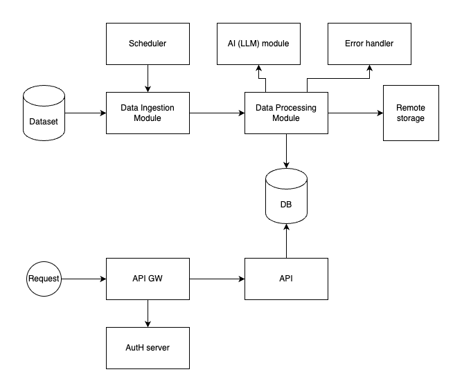

# High Level Architecture

* The PoC Architecture is containing two main components and a few sub-modules
  * The Data Ingestion and Processing module together with increment processor
    * The Data Ingestion is responsible for ingesting the data from the source
    * The Data Processor is enriching data and store unique data in the data store and store all increments remotely
    * Error handler for processing corrupted data(notifications, logging, etc)
  * API to provide Read access to the data
    * API Gateway to provide access to the API itself
    * AutH server to allow authentication on API level

# Move to Production - considerations
* Scalability
  * Utilize scalable services and distributed processing frameworks between Ingestion and Processing to handle changes in datasets (e.g., Apache Kafka, Spark).
  * Make Processing module scalable (parallelization).
* Reliability 
  * Implement retry mechanisms in the Data Ingestion Module.
  * Use monitoring tools to track system health and performance (APM).
  * Integrate logging at each stage for debugging and auditing purposes.
  * Set up alerts for failures or performance bottlenecks.
* Data Integrity
  * Manual/automated process for manage corrupted data.
  * Regularly backup the database and have disaster recovery plans in place.
* Security
  * Ensure data encryption at rest and transit.
  * Regularly update authentication protocols and monitor for unauthorized access.
  * Automated and regular scanning of source code and all container for vulnerabilities.
* CI/CD
  * Implement automated testing for each module.
  * Implement CI/CD pipelines for automated deployment and testing.

# Development
[src/README.md](src/README.md)

# Deployment
[infrastructure/README.md](infrastructure/README.md)
